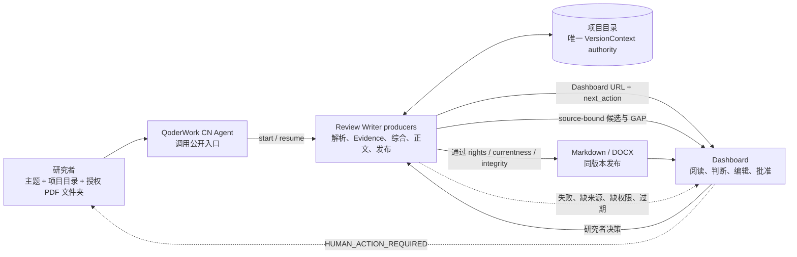

# Review Writer 产品流程

这份图是产品的公开流程说明，面向研究者、评审和 QoderWork CN 用户。它描述“谁做什么”，
不要求用户运行命令，也不把内部文件当作用户界面。

## 一张图看懂



## 公开用户流程

```text
1. 输入 topic、explicit project root、authorized PDF folder
2. Agent 创建或恢复项目，并返回 Dashboard
3. 研究者确认来源身份：MAIN / SI / 排除
4. 研究者核对解析质量和 parser provenance
5. 系统生成 source-bound Paper Evidence candidates
6. 研究者批准、修改或拒绝 Evidence
7. 研究者确认 Comparison Protocol
8. 系统生成 source-bound Synthesis candidates
9. 研究者确认 Section Contract 和正文 v1
10. 研究者编辑并批准正文，形成 v2
11. 研究者决定是否使用真实来源图件，并核对署名、权利和正文绑定
12. 系统生成同版本 Markdown / DOCX release
13. 研究者检查 release、历史版本和 cold resume
```

## 人工闸门和系统动作

| 阶段 | 系统负责 | 研究者负责 | 失败时的正确结果 |
| --- | --- | --- | --- |
| 来源映射 | 读取授权目录、记录 hash、提供候选身份 | 确认 MAIN/SI/排除 | `HUMAN_ACTION_REQUIRED`，不猜身份 |
| 解析质量 | 记录 MinerU 或真实 fallback、页码和能力缺口 | 判断文本是否足以支撑本项目 | 来源级 `GAP` / `OCR_REQUIRED` / 重试 |
| Evidence | 生成带 locator、quote、digest 的候选 | 批准或拒绝事实 | 未批准不进入综合 |
| Comparison | 保留研究边界、标注 `NOT_COMPARABLE` | 确认比较协议 | 不能比较的字段保持 GAP |
| Synthesis | 只消费已批准或明确允许的证据 | 审核归纳、冲突和限制 | `HUMAN_ACTION_REQUIRED` |
| Manuscript | 生成 v1、保留 lineage、支持 v2 | 编辑并批准正文 | 旧 release 变 stale |
| Figures | 展示真实来源图件候选、rights 和 hash | 选择、署名、绑定正文 | 无真实资产则 `FIGURE_GAP` |
| Release | 校验 currentness、DOCX integrity 和同版本关系 | 下载、复核、接受 | 零写或 `RELEASE_OUTDATED` |

## 状态怎么解释

- `HUMAN_ACTION_REQUIRED`：需要研究者在 Dashboard 决策；Agent 必须停下。
- `GAP`：当前没有足够来源证据，不能写成事实。
- `NOT_COMPARABLE`：来源存在，但条件或定义不允许横向比较。
- `HOLD`：工程或权利前置条件未满足，不能发布。
- `RELEASE_OUTDATED`：正文已经变化，必须 regenerate，不能继续下载旧文件。
- `AGENT_E2E_PASS`：只表示公开 Agent 能完成产品链；不等于科学结论已被专家认可。

## 给评审的三分钟演示

1. 展示用户只需要三项输入，不需要 CLI、curl、pytest 或手工 JSON。
2. 打开 Dashboard 的“来源与证据”，展示来源 hash、MAIN/SI、解析方式和人工闸门。
3. 打开 Paper Evidence，展示一条带页码、原文引用和来源绑定的候选。
4. 展示 Synthesis 中的共识、差异、冲突和 GAP，而不是只展示一段没有边界的摘要。
5. 打开“图表”，展示真实来源图件、署名、rights 和 `FIGURE_GAP` 的诚实状态。
6. 打开“发布与历史”，展示 Markdown/DOCX 同版本，以及正文修改后旧 release 变 stale。
7. 最后说明：科学有效性和最终 HUMAN_ACCEPTANCE 由研究者负责，产品不会伪造批准。

## 当前产品边界

Review Writer 是证据治理和综述生产工作台，不是自动替研究者完成科学判断的黑箱。它可以
帮助组织授权语料、保留来源证据、发现 GAP、生成可审计草稿和发布文件；它不能仅凭文本解析
自动证明机理正确、结构字段正确或综述具有完整的领域覆盖率。

Chemical Paper 是可选的结构增强路线。普通 PDF-only 综述可以沿 Generic-only 路线继续；只有
用户需要 molecule、SMILES、molblock 或反应结构时，才进入 Chemical Evidence 人工闸门。
